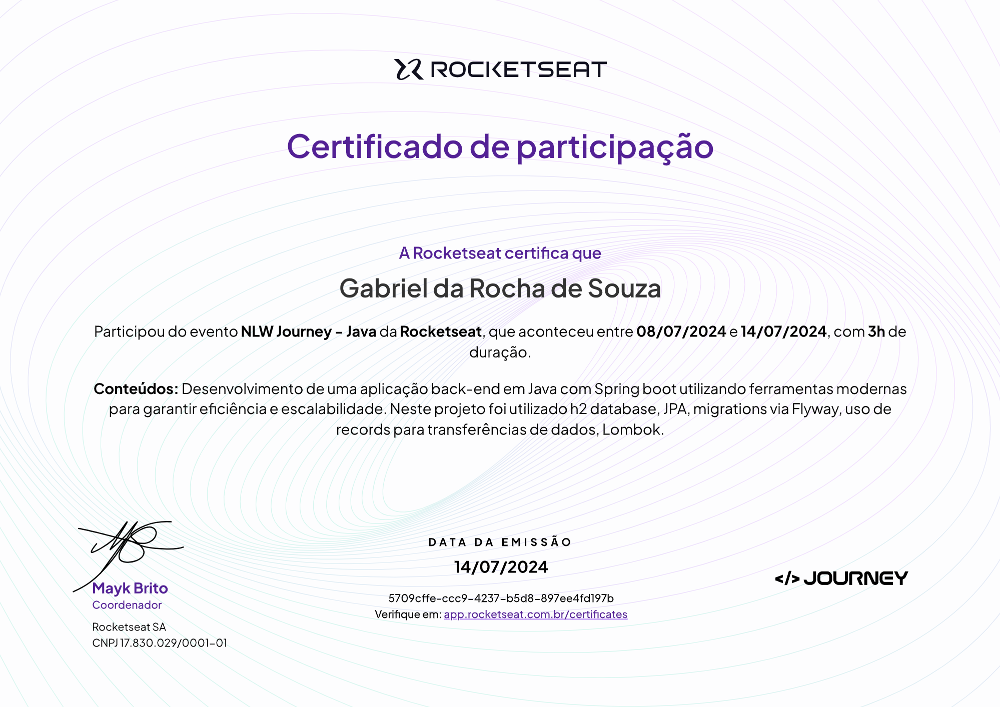

# Planner API Project

This project was developed at the NLW of Rocketseat, it is an application that aims to help manage trips planning;

It was developed using java with spring.

In this application you can send emails to the participants to confirm the trip;

This application was deployed on render, using docker;

It also uses a postgres database from render to store the data;

<a href="https://trip-planner-nlw-2024-trilha-java.onrender.com/">API Deployed Link</a>

## Documentation

To check the endpoints of the application access this <a href="https://trip-planner-nlw-2024-trilha-java.onrender.com/swagger-ui/index.html">link</a>

To test the endpoints in insomnia download this <a href="https://github.com/gabrielrochasouza/trip-planner-nlw-2024-trilha-java/blob/main/Insomnia_2024-07-15.json">file</a>

